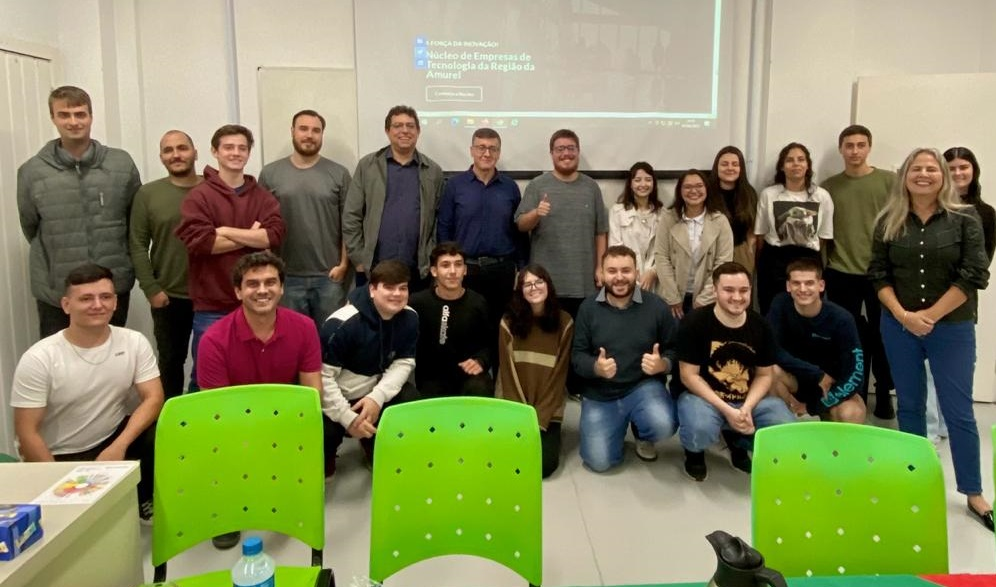

# queiraeu

## Projeto Final curso Projeto [Programando o Futuro - Turma 2023A](https://amureltec.com.br/programandoofuturo/)   

Feito para mobile, fica desregulado em alguns tamanhos e em desktop, apenas protótipo para testar o lead capturado no instagram.

• Utilizei os conhecimentos transmitidos pelos professores Fabricio Bueno Borges dos Santos   
  e Simone Regina da Silva durante o Programando o Futuro 2023 no desenvolvimento.   
   
• Fontes:   
  • Tecnologias: HTML e CSS, para melhorar o tempo, não vou matar uma formiga com um canhão.   
  • Fonte dos texto: https://www.dafont.com/pt/.   
  • Fonte da imagem de redirecionamento e logo: https://www.canva.com/.   
  • Fonte do desenho do "dorso de esqueleto cheirando rosa":   
    Criado pelo artista e tatuador local, conhecido como Jesus. Instagram: j_e_s_v_s.   
  • Fonte do favicon: Geradores de favicon Genéricos.

• Utilizei a Topologia AIDA parao site: 
🎯 O funil de vendas AIDA é um conceito essencial que pode ser aplicado à venda, seguindo os princípios do marketing. A estrutura de conversão AIDA consiste nos seguintes estágios: Atenção, Interesse, Desejo e Ação.   
   
Dito isso, vamos aos passos:   

🔍 Na etapa "A" de Atenção, é crucial capturar a atenção do potencial cliente através do reconhecimento da marca. É importante criar consciência sobre o produto e seus benefícios.   

Exemplos:   
📲 Anúncio nas redes sociais.   
🤝 Parceria com um blog popular do tema.   
   
🤔 Em seguida, no estágio "I" de Interesse, busca-se despertar o interesse do cliente ao educá-lo sobre as vantagens do produto. Nesse exemplo, foi utilizado um depoimento pessoal como forma de criar conexão e estimular o interesse do público.   
   
Exemplos:   
📚 Criação do interesse ao aprender sobre os benefícios da marca.   
🎯 Foco nas necessidades de cada nicho.   
   
💡 No estágio "D" de Desejo, o objetivo é gerar o desejo de possuir o produto, oferecendo amostras ou destacando necessidades que podem ser atendidas por ele. É fundamental criar um senso de valor e exclusividade em relação ao produto.   
   
Exemplos:   
💬 Depoimentos de clientes de sucesso.   
⏳ Oferta por tempo limitado ou para poucos compradores.   
   
📢 Por fim, na etapa "A" de Ação, é feita a chamada para ação (Call to Action) que direciona o cliente para uma oferta e, idealmente, para a concretização da venda. Nesse momento, é importante facilitar o processo de compra e garantir que o cliente seja levado a tomar a ação desejada.   
   
Exemplos:   
💰 Inclusão de um botão de compra visível.   
🔥 Frase persuasiva no botão.   

Link com a postagem sobre a topologia: [CLIQUE AQUI](https://www.linkedin.com/posts/henriquegnu_marketing-redessociais-vendas-activity-7069492580547239937-R4pn?utm_source=share&utm_medium=member_desktop)   
Imagem abaixo:

  

   
Imagens apresentação final:

  

   

  

   
Nota final 10.0
